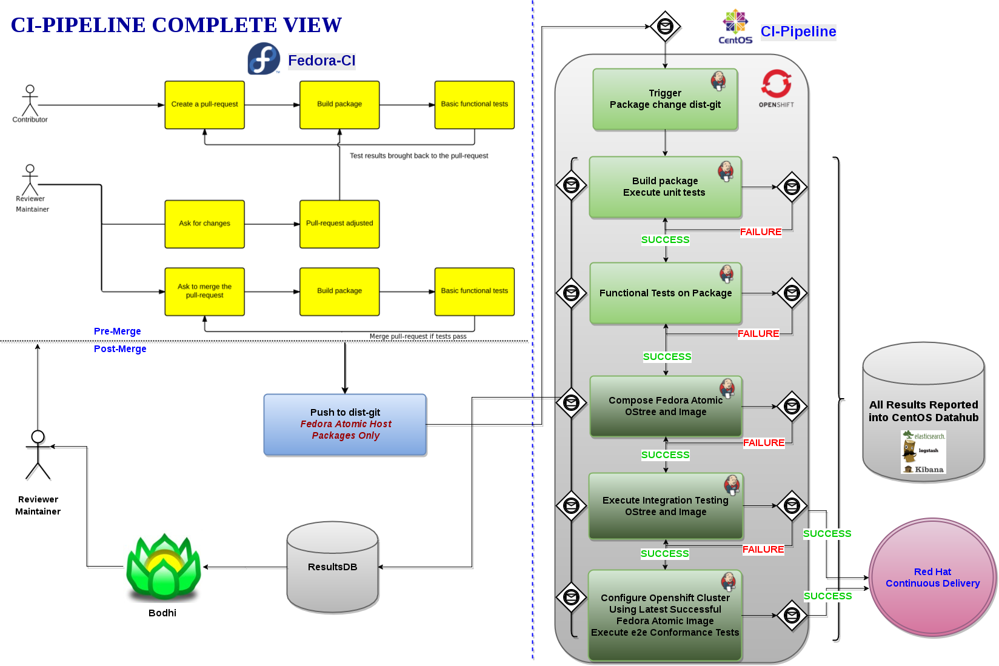
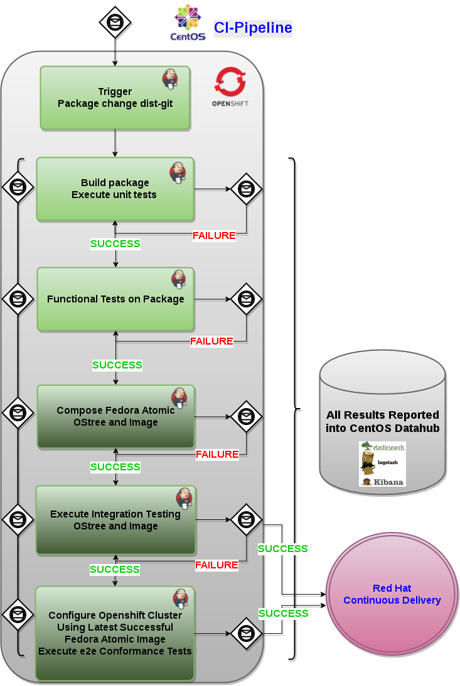

<!-- START doctoc generated TOC please keep comment here to allow auto update -->
<!-- DON'T EDIT THIS SECTION, INSTEAD RE-RUN doctoc TO UPDATE -->
**Table of Contents**

- [CI-Pipeline Architecture and Design](#ci-pipeline-architecture-and-design)
  - [Overview](#overview)
  - [Dependencies and Assumptions](#dependencies-and-assumptions)
  - [Infrastructure and Tools](#infrastructure-and-tools)
  - [CI-Pipeline Complete View](#ci-pipeline-complete-view)
  - [Pipeline Stages](#pipeline-stages)
    - [Trigger](#trigger)
    - [Build Package](#build-package)
    - [Functional Tests on Package](#functional-tests-on-package)
    - [Compose OStree](#compose-ostree)
    - [Integration Tests on OStree](#integration-tests-on-ostree)
    - [e2e Conformance Tests on Openshift Clusters](#e2e-conformance-tests-on-openshift-clusters)
    - [Image Generated From Successful Integration Tests On OStree](#image-generated-from-successful-integration-tests-on-ostree)
    - [Image Smoke Test Validation](#image-smoke-test-validation)
  - [Message Bus](#message-bus)
    - [Message Types](#message-types)
      - [Message Legend](#message-legend)
      - [Trigger - org.fedoraproject.prod.git.receive](#trigger---orgfedoraprojectprodgitreceive)
      - [Dist-git message example](#dist-git-message-example)
      - [org.centos.prod.ci.pipeline.package.ignore](#orgcentosprodcipipelinepackageignore)
      - [org.centos.prod.ci.pipeline.package.queued](#orgcentosprodcipipelinepackagequeued)
      - [org.centos.prod.ci.pipeline.package.running](#orgcentosprodcipipelinepackagerunning)
      - [org.centos.prod.ci.pipeline.package.complete](#orgcentosprodcipipelinepackagecomplete)
      - [org.centos.prod.ci.pipeline.package.test.functional.queued](#orgcentosprodcipipelinepackagetestfunctionalqueued)
      - [org.centos.prod.ci.pipeline.package.test.functional.running](#orgcentosprodcipipelinepackagetestfunctionalrunning)
      - [org.centos.prod.ci.pipeline.package.test.functional.complete](#orgcentosprodcipipelinepackagetestfunctionalcomplete)
      - [org.centos.prod.ci.pipeline.compose.running](#orgcentosprodcipipelinecomposerunning)
      - [org.centos.prod.ci.pipeline.compose.complete](#orgcentosprodcipipelinecomposecomplete)
      - [org.centos.prod.ci.pipeline.image.running](#orgcentosprodcipipelineimagerunning)
      - [org.centos.prod.ci.pipeline.image.complete](#orgcentosprodcipipelineimagecomplete)
      - [org.centos.prod.ci.pipeline.image.test.smoke.running](#orgcentosprodcipipelineimagetestsmokerunning)
      - [org.centos.prod.ci.pipeline.image.test.smoke.complete](#orgcentosprodcipipelineimagetestsmokecomplete)
      - [org.centos.prod.ci.pipeline.compose.test.integration.queued](#orgcentosprodcipipelinecomposetestintegrationqueued)
      - [org.centos.prod.ci.pipeline.compose.test.integration.running](#orgcentosprodcipipelinecomposetestintegrationrunning)
      - [org.centos.prod.ci.pipeline.compose.test.integration.complete](#orgcentosprodcipipelinecomposetestintegrationcomplete)
    - [Reporting Results](#reporting-results)

<!-- END doctoc generated TOC please keep comment here to allow auto update -->

# CI-Pipeline Architecture and Design

## Overview

The CI-Pipeline is designed to take the Fedora dist-git repos that make up the Fedora Atomic Host and build the RPMs and create the OStree composes and images.  Tests will run at different pipeline stages of the pipeline.  Unit tests will run during the building of the RPMs.  Once RPMs are built successfully functional tests will run against these packages.  Once the compose of the OStree and images is complete integration of the entire host image will be executed.  The final piece is to configure an Origin Openshift cluster using the Atomic Openshift Installer on top of the Fedora Atomic Host images and executing the e2e conformance tests.  Once the OStree and images are validated a message will be published on the fedmsg bus under the CentOS CI topic.

The backbone of communication is fedmsg.  Success and failures of the different pipeline stages will be communicated to reviewers/maintainers in Fedora as well as in the CentOS CI-Pipeline.  The reviewers/maintainers can initially choose to &quot;opt-in&quot; and ultimately be a gating requirement.  When a new OStree and image is available and has passed an acceptable level of testing messages will be published and then Red Hat continuous delivery phase will consume these OStrees and images.

## Dependencies and Assumptions

The CI-Pipeline is not an automation framework or automated tests.  CI in general is the continuous integration of components and validating these work together.  In this case being Fedora Atomic Host. The CI-Pipeline accommodates any automation framework and tests.  Unit tests can easily be defined as make targets and can run as part of the build and need minimal resources.  Functional and integration testing may require more robust test beds to execute scenarios.

Setup and invoking of tests will be done using ansible as outlined in [Invoking Tests Using Ansible](https://fedoraproject.org/wiki/Changes/InvokingTestsAnsible)

Setup and invoking of tests will be done using ansible as outlined in Invoking Tests Using Ansible

We assume that there will be tests available to execute otherwise there is nothing besides building, composing, and configuring an Openshift cluster to validate the OStrees and images.  There is currently tests available for many of the Atomic components as well as the Kubernetes e2e conformance tests.

The CI-Pipeline can be defined using Jenkins Job Builder short-term and Jenkins Pipeline (Jenkinsfile) long-term.  This will be the Jenkins 2.0 Pipeline that is already integrated in Openshift [(Openshift Pipelines Deep Dive)](https://blog.openshift.com/openshift-3-3-pipelines-deep-dive/).

We are dependent on the CentOS CI infrastructure for Openshift, Jenkins resources, test resources (bare metal machines, VMs, containers), datahub, and the fedmsg hub.

## Infrastructure and Tools

The CI-Pipeline will use CentOS CI for Jenkins master and slave resources.  We plan to move these into an Openshift environment and back our Jenkins with persistent volumes.  Initially all jobs will be defined using [Jenkins Job Builder](https://docs.openstack.org/infra/jenkins-job-builder/), but the team plans in the long-term to move these to a [Jenkins Pipeline](https://jenkins.io/doc/book/pipeline/) using the Jenkinsfile declarative format.  We will be using the [Jenkins JMS plugin](https://wiki.jenkins-ci.org/display/JENKINS/JMS+Messaging+Plugin) to listen and publish messages on fedmsg.  There will be other plugins used such as the email ext and groovy, but most will be part of the core of Jenkins 2.0

The pipeline will use [Linch-pin](https://github.com/CentOS-PaaS-SIG/linch-pin) for the provisioning of resources.  Linch-pin allows us to provision bare metal and VMs in many infrastructures such as AWS, Openstack, GCE, Duffy, libvirt,  and Beaker.

CentOS CI will have its own fedmsg topic and a hub to route messages that are published.  We also need a Datahub in CentOS CI for persistent results data.

Currently documentation, jobs, tools, etc. are stored at [CentOS CI-Pipeline](https://github.com/CentOS-PaaS-SIG/ci-pipeline).


## CI-Pipeline Complete View

 

## Pipeline Stages

### Trigger

Once packages are pushed to Fedora dist-git this will trigger a message.  The pipeline will be triggered via the   [Jenkins JMS plugin](https://wiki.jenkins-ci.org/display/JENKINS/JMS+Messaging+Plugin) for dist-git messages on fedmsg.  This could also be manually triggered by a reviewer/maintainer as well.  Only Fedora Atomic Host packages will be monitored for changes currently.  This may broaden in the long-term.

CI Pipeline messages sent via fedmsg for this stage are captured by the topics org.centos.prod.ci.pipeline.package.[queued,ignored].

### Build Package

Once the pipeline is triggered as part of the build process if unit tests exist they will be executed.

The end result is package will be produced to then be used for further testing.  Success or failure will result with a fedmsg back to the Fedora reviewer/maintainer.

CI Pipeline messages sent via fedmsg for this stage are captured by the topics org.centos.prod.ci.pipeline.package.[running,complete].

### Functional Tests on Package

Functional tests will be executed on the produced package from the previous stage of the pipeline if they exist.  This will help identify issues isolated to the package themselves.  Success or failure will result with a fedmsg back to the Fedora reviewer/maintainer.

CI Pipeline messages sent via fedmsg for this stage are captured by the topics org.centos.prod.ci.pipeline.package.test.functional.[queued,running,complete].

### Compose OStree

If functional tests are successful in the previous stage of the pipeline then an OStree compose is generated.

CI Pipeline messages sent via fedmsg for this stage are captured by the topics org.centos.prod.ci.pipeline.compose.[queued,running,complete].

### Integration Tests on OStree

Integration tests are run on the OStree compose.  Success or failure will result with a fedmsg back to the Fedora reviewer/maintainer.  Also, this can trigger the Red Hat continuous delivery process to run more comprehensive testing if desired.

CI Pipeline messages sent via fedmsg for this stage are captured by the topics org.centos.prod.ci.pipeline.compose.test.integration[queued,running,complete].

### e2e Conformance Tests on Openshift Clusters

If integration tests of the images are successful an openshift cluster will be configured using the Atomic Openshift Installer with the new Fedora Atomic Host image as the base system.  Once the cluster is configured Kubernetes conformance tests will run. Success or failure will result with a fedmsg back to the Fedora reviewer/maintainer.  Also, this can trigger the Red Hat continuous delivery process to run more comprehensive testing if desired.

### Image Generated From Successful Integration Tests On OStree

An image will be initially generated at a certain interval when there has been successful integration test execution on an OStree compose. Success or failure will result with a fedmsg back to the Fedora reviewer/maintainer.  Also, this can trigger the Red Hat continuous delivery process to run more comprehensive testing if desired.

CI Pipeline messages sent via fedmsg for this stage are captured by the topics org.centos.prod.ci.pipeline.image.[queued,running,complete].

### Image Smoke Test Validation

The validation left is to make sure the image can boot and more smoke tests may follow if required.  Success or failure will result with a fedmsg back to the Fedora reviewer/maintainer.  Also, this can trigger the Red Hat continuous delivery process to run more comprehensive testing.

CI Pipeline messages sent via fedmsg for this stage are captured by the topics org.centos.prod.ci.pipeline.image.test.smoke.[queued,running,complete].

## Message Bus

Communication between Fedora, CentOS, and Red Hat infrastructures will be done via fedmsg.  Messages will be received of updates to dist-git repos that we are concerned about for Fedora Atomic host.  Triggering will happen from Fedora dist-git. The CI-Pipeline in CentOS infrastructure will build and functional test packages, compose and integration test ostrees, generate and smoke test (boot) images.  We are dependant on CentOS Infrastructure for allowing us a hub for publishing messages to fedmsg.

### Message Types
Below are the different message types that we listen and publish.  There will be different subtopics so we can keep things organized under the org.centos.prod.ci.pipeline.* umbrella. The fact that ‘org.centos’ is contained in the messages is a side effect of the way fedmsg enforces message naming.

#### Message Legend

* CI_TYPE - Type of message we are sending (default value = custom)
  - ex. custom
* build_id - Jenkins pipeline build ID
  - ex. 91
* build_url - Full url to the Jenkins pipeline build  
  - ex. https://jenkins-continuous-infra.apps.ci.centos.org/job/ci-pipeline-f26/91/
* username - Audit of who is sending the message (default value = fedora-atomic)
  - ex. fedora_atomic
* compose_url - Full url to the OStree compose 
  - ex. http://artifacts.ci.centos.org/artifacts/fedora-atomic/f26/ostree
* compose_rev - SHA-1 of the compose
  - ex. c15b07cc0f560dd4325b64b8ed8f5750ab102f2ff2e0ace39cda4158f900e4da
* rev - This is the commit SHA-1 that is passed on from the dist-git message we recieve 
  - ex. 591b0d2fc67a45e4ad13bdc3e312d5554852426a
* image_url - Full url to the image 
  - ex. http://artifacts.ci.centos.org/artifacts/fedora-atomic/f26/images/fedora-atomic-26.200-c15b07cc0f560dd.qcow2
* image_name - Image name
  - ex. fedora-atomic-26.200-c15b07cc0f560dd.qcow2
* message-content - If additional content is needed in the bod of the message (default = "")
* namespace - Packaging type passed from dist-git message 
  - ex. rpms
* original_spec_nvr - The NVR of the RPM if the spec file hadn't been modified
  - ex. gnutls-3.5.15-1.fc26
* nvr - The NVR of the RPM after modification, so including sha and # commits
  - ex. gnutls-3.5.15-1.246.a3e666c.fc26
* CI_NAME - Jenkins pipeline job name
  - ex. ci-pipeline-f26
* repo - Package name
  - ex. vim
* topic - Topic that is being published on the fedmsg bus
  - ex. org.centos.prod.ci.pipeline.image.complete
* status - Status of the stage and overall pipeline at the time when the message is published
  - ex. SUCCESS
  - options = <SUCCESS/FAILURE/ABORTED>
* branch - Fedora branch master = rawhide for now this may change in the future 
  - ex. f26
* type - Image type 
  - ex. qcow2
* test_guidance - <comma-separated-list-of-test-suites-to-run> required by downstream CI
  - ex. "''"
* ref - Indication of what we are building distro/branch/arch/distro_type
  - ex. fedora/f26/x86_64/atomic-host


Each change passing through the pipeline is uniquely identified by repo, rev, and namespace. 

#### Trigger - org.fedoraproject.prod.git.receive

Below is an example of the message that we will trigger off of to start our CI pipeline.  We concentrate on the commit part of the message.

````
username=jchaloup
stats={u'files': {u'fix-rootScopeNaming-generate-selfLink-issue-37686.patch': {u'deletions': 8, u'additions': 8, u'lines': 16}, u'build-with-debug-info.patch': {u'deletions': 8, u'additions': 8, u'lines': 16}, u'get-rid-of-the-git-commands-in-mungedocs.patch': {u'deletions': 25, u'additions': 0, u'lines': 25}, u'kubernetes.spec': {u'deletions': 13, u'additions': 11, u'lines': 24}, u'remove-apiserver-add-kube-prefix-for-hyperkube-remov.patch': {u'deletions': 0, u'additions': 169, u'lines': 169}, u'.gitignore': {u'deletions': 1, u'additions': 1, u'lines': 2}, u'sources': {u'deletions': 1, u'additions': 1, u'lines': 2}, u'remove-apiserver-add-kube-prefix-for-hyperkube.patch': {u'deletions': 66, u'additions': 0, u'lines': 66}, u'use_go_build-is-not-fully-propagated-so-make-it-fixe.patch': {u'deletions': 5, u'additions': 5, u'lines': 10}, u'Hyperkube-remove-federation-cmds.patch': {u'deletions': 118, u'additions': 0, u'lines': 118}, u'fix-support-for-ppc64le.patch': {u'deletions': 9, u'additions': 9, u'lines': 18}}, u'total': {u'deletions': 254, u'files': 11, u'additions': 212, u'lines': 466}}
name=Jan Chaloupka
namespace=rpms
rev=b0ef5e0207cea46836a49cd4049908f14015ed8d
agent=jchaloup
summary=Update to upstream v1.6.1
repo=kubernetes
branch=f26
path=/srv/git/repositories/rpms/kubernetes.git
seen=False
message=Update to upstream v1.6.1- related: #1422889
email=jchaloup@redhat.com
````

#### Dist-git message example
````
{
  "source_name": "datanommer",  
  "i": 1, 
  "timestamp": 1493386183.0, 
  "msg_id": "2017-b29fa2b4-0600-4f08-9475-5f82f6684bd4", 
  "topic": "org.fedoraproject.prod.git.receive", 
  "source_version": "0.6.5", 
  "signature": "MbQSb1uwzh6UIFKVm+Uxt+56nW/QRH1nOehifxUrbZfiEDEscRdHtb8dj1Skdv7fcZGHhNlR3PGI\nz/4YqPFJjoAM/k60FsnBIIG1gklJaFBM8MloEYauzo/fUK//W99ojk3UPK0lGTIBijG2knbD9t3T\nUMRuDjt45zmGBXHPlR8=\n", 
  "msg": {
    "commit": {
      "username": "trasher", 
      "stats": {
        "files": {
          "sources": {
            "deletions": 1, 
            "additions": 1, 
            "lines": 2
          }, 
          "php-simplepie.spec": {
            "deletions": 5, 
            "additions": 8, 
            "lines": 13
          }, 
          ".gitignore": {
            "deletions": 0, 
            "additions": 1, 
            "lines": 1
          }
        }, 
        "total": {
          "deletions": 6, 
          "files": 3, 
          "additions": 10, 
          "lines": 16
        }
      }, 
      "name": "Johan Cwiklinski", 
      "rev": "81e09b9c83e8550b54a64c7bdb4e5d7b534df058", 
      "namespace": "rpms", 
      "agent": "trasher", 
      "summary": "Last upstream release", 
      "repo": "php-simplepie", 
      "branch": "f24", 
      "seen": false, 
      "path": "/srv/git/repositories/rpms/php-simplepie.git", 
      "message": "Last upstream release\n", 
      "email": "johan@x-tnd.be"
    }
  }
}
````

#### org.centos.prod.ci.pipeline.package.ignore

````
{ 
  "i": 1,
  "msg_id": "2017-9987b043-b558-4b99-96e0-327548248e65",
  "timestamp": 1501615199,
  "crypto": "x509", 
  "topic": "org.centos.prod.ci.pipeline.package.ignore",   
  "msg": {
      "CI_NAME": "ci-pipeline-trigger",
      "CI_TYPE": "custom",
      "branch": "f26",
      "build_id": "16405",
      "build_url": "https://jenkins-continuous-infra.apps.ci.centos.org/job/ci-pipeline-trigger/16405/",
      "message-content": "",
      "namespace": "rpms",
      "ref": "fedora/f26/x86_64/atomic-host",
      "repo": "electrum",
      "rev": "8346cbfc821c824c5e5b1a42ac92f8b49ea843a4",
      "status": "SUCCESS",
      "test_guidance": "''",
      "topic": "org.centos.stage.ci.pipeline.package.ignore",
      "username": "fedora-atomic"
  }
}
````

#### org.centos.prod.ci.pipeline.package.queued

````
{
  "i": 1,
  "timestamp": 1501740103,
  "msg_id": "2017-6965f933-09fe-4dfd-8812-6fddc0b61f3d",
  "crypto": "x509",
  "topic": "org.centos.prod.ci.pipeline.package.queued",
  "msg": {
    "CI_TYPE": "custom",
    "build_id": "91",
    "username": "fedora-atomic",
    "rev": "591b0d2fc67a45e4ad13bdc3e312d5554852426a",
    "message-content": "",
    "build_url": "https://jenkins-continuous-infra.apps.ci.centos.org/job/ci-pipeline-f26/91/",
    "namespace": "rpms",
    "CI_NAME": "ci-pipeline-f26",
    "repo": "vim",
    "topic": "org.centos.prod.ci.pipeline.package.queued",
    "status": "SUCCESS",
    "branch": "f26",
    "test_guidance": "''",
    "ref": "fedora/f26/x86_64/atomic-host"
  }
}
````

#### org.centos.prod.ci.pipeline.package.running

````
{
  "i": 1,
  "timestamp": 1501740103,
  "msg_id": "2017-6965f933-09fe-4dfd-8812-6fddc0b61f3d",
  "crypto": "x509",
  "topic": "org.centos.prod.ci.pipeline.package.running",
  "msg": {
    "CI_TYPE": "custom",
    "build_id": "91",
    "username": "fedora-atomic",
    "rev": "591b0d2fc67a45e4ad13bdc3e312d5554852426a",
    "message-content": "",
    "build_url": "https://jenkins-continuous-infra.apps.ci.centos.org/job/ci-pipeline-f26/91/",
    "namespace": "rpms",
    "CI_NAME": "ci-pipeline-f26",
    "repo": "vim",
    "topic": "org.centos.prod.ci.pipeline.package.running",
    "status": "SUCCESS",
    "branch": "f26",
    "test_guidance": "''",
    "ref": "fedora/f26/x86_64/atomic-host"
  }
}
````

#### org.centos.prod.ci.pipeline.package.complete

````
{
  "i": 1,
  "timestamp": 1501741048,
  "msg_id": "2017-b420134c-0e39-4f70-8e5f-0975d7019e4b",
  "crypto": "x509",
  "topic": "org.centos.prod.ci.pipeline.package.complete",
  "msg": {
    "CI_TYPE": "custom",
    "build_id": "91",
    "username": "fedora-atomic",
    "rev": "591b0d2fc67a45e4ad13bdc3e312d5554852426a",
    "message-content": "",
    "build_url": "https://jenkins-continuous-infra.apps.ci.centos.org/job/ci-pipeline-f26/91/",
    "namespace": "rpms",
    "CI_NAME": "ci-pipeline-f26",
    "repo": "vim",
    "original_spec_nvr": "vim-7.4.160-1.fc26",
    "nvr": "vim-7.4.160-1.200.591b0d2.fc26",
    "topic": "org.centos.prod.ci.pipeline.package.complete",
    "status": "SUCCESS",
    "test_guidance": "''",
    "branch": "f26",
    "package_url": "http://artifacts.ci.centos.org/fedora-atomic/f26/repo/vim_repo/",
    "ref": "fedora/f26/x86_64/atomic-host"
  }
}
````

#### org.centos.prod.ci.pipeline.package.test.functional.queued

````
{
  "i": 1,
  "timestamp": 1501741048,
  "msg_id": "2017-b420134c-0e39-4f70-8e5f-0975d7019e4b",
  "crypto": "x509",
  "topic": "org.centos.prod.ci.pipeline.package.test.functional.queued",
  "msg": {
    "CI_TYPE": "custom",
    "build_id": "91",
    "username": "fedora-atomic",
    "rev": "591b0d2fc67a45e4ad13bdc3e312d5554852426a",
    "message-content": "",
    "build_url": "https://jenkins-continuous-infra.apps.ci.centos.org/job/ci-pipeline-f26/91/",
    "namespace": "rpms",
    "CI_NAME": "ci-pipeline-f26",
    "repo": "vim",
    "original_spec_nvr": "vim-7.4.160-1.fc26",
    "nvr": "vim-7.4.160-1.200.591b0d2.fc26",
    "topic": "org.centos.prod.ci.pipeline.package.test.functional.queued",
    "status": "SUCCESS",
    "test_guidance": "''",
    "branch": "f26",
    "package_url": "http://artifacts.ci.centos.org/fedora-atomic/f26/repo/vim_repo/",
    "ref": "fedora/f26/x86_64/atomic-host"
  }
}
````

#### org.centos.prod.ci.pipeline.package.test.functional.running

````
{
  "i": 1,
  "timestamp": 1501741048,
  "msg_id": "2017-b420134c-0e39-4f70-8e5f-0975d7019e4b",
  "crypto": "x509",
  "topic": "org.centos.prod.ci.pipeline.package.test.functional.running",
  "msg": {
    "CI_TYPE": "custom",
    "build_id": "91",
    "username": "fedora-atomic",
    "rev": "591b0d2fc67a45e4ad13bdc3e312d5554852426a",
    "message-content": "",
    "build_url": "https://jenkins-continuous-infra.apps.ci.centos.org/job/ci-pipeline-f26/91/",
    "namespace": "rpms",
    "CI_NAME": "ci-pipeline-f26",
    "repo": "vim",
    "original_spec_nvr": "vim-7.4.160-1.fc26",
    "nvr": "vim-7.4.160-1.200.591b0d2.fc26",
    "topic": "org.centos.prod.ci.pipeline.package.test.functional.running",
    "status": "SUCCESS",
    "test_guidance": "''",
    "branch": "f26",
    "package_url": "http://artifacts.ci.centos.org/fedora-atomic/f26/repo/vim_repo/",
    "ref": "fedora/f26/x86_64/atomic-host"
  }
}
````

#### org.centos.prod.ci.pipeline.package.test.functional.complete

````
{
  "i": 1,
  "timestamp": 1501741048,
  "msg_id": "2017-b420134c-0e39-4f70-8e5f-0975d7019e4b",
  "crypto": "x509",
  "topic": "org.centos.prod.ci.pipeline.package.test.functional.complete",
  "msg": {
    "CI_TYPE": "custom",
    "build_id": "91",
    "username": "fedora-atomic",
    "rev": "591b0d2fc67a45e4ad13bdc3e312d5554852426a",
    "message-content": "",
    "build_url": "https://jenkins-continuous-infra.apps.ci.centos.org/job/ci-pipeline-f26/91/",
    "namespace": "rpms",
    "CI_NAME": "ci-pipeline-f26",
    "repo": "vim",
    "original_spec_nvr": "vim-7.4.160-1.fc26",
    "nvr": "vim-7.4.160-1.200.591b0d2.fc26",
    "topic": "org.centos.prod.ci.pipeline.package.test.functional.complete",
    "status": "SUCCESS",
    "test_guidance": "''",
    "branch": "f26",
    "package_url": "http://artifacts.ci.centos.org/fedora-atomic/f26/repo/vim_repo/",
    "ref": "fedora/f26/x86_64/atomic-host"
  }
}
````

#### org.centos.prod.ci.pipeline.compose.running

````
{
  "i": 1,
  "timestamp": 1501741053,
  "msg_id": "2017-5e9a2f3e-d593-4cdf-ab8e-fead7c95e477",
  "crypto": "x509",
  "topic": "org.centos.prod.ci.pipeline.compose.running",
  "msg": {
    "CI_TYPE": "custom",
    "build_id": "91",
    "username": "fedora-atomic",
    "compose_url": "http://artifacts.ci.centos.org/artifacts/fedora-atomic/f26/ostree",
    "rev": "591b0d2fc67a45e4ad13bdc3e312d5554852426a",
    "message-content": "",
    "build_url": "https://jenkins-continuous-infra.apps.ci.centos.org/job/ci-pipeline-f26/91/",
    "namespace": "rpms",
    "CI_NAME": "ci-pipeline-f26",
    "repo": "vim",
    "original_spec_nvr": "vim-7.4.160-1.fc26",
    "nvr": "vim-7.4.160-1.200.591b0d2.fc26",
    "compose_rev": "''",
    "topic": "org.centos.prod.ci.pipeline.compose.running",
    "status": "SUCCESS",
    "branch": "f26",
    "test_guidance": "''",
    "ref": "fedora/f26/x86_64/atomic-host"
  }
}
````

#### org.centos.prod.ci.pipeline.compose.complete

````
{
  "i": 1,
  "timestamp": 1501741878,
  "msg_id": "2017-ee8a4e90-7683-420b-a33a-05d2bc438c6c",
  "crypto": "x509",
  "topic": "org.centos.prod.ci.pipeline.compose.complete",
  "msg": {
    "CI_TYPE": "custom",
    "build_id": "91",
    "username": "fedora-atomic",
    "compose_url": "http://artifacts.ci.centos.org/artifacts/fedora-atomic/f26/ostree",
    "rev": "591b0d2fc67a45e4ad13bdc3e312d5554852426a",
    "message-content": "",
    "build_url": "https://jenkins-continuous-infra.apps.ci.centos.org/job/ci-pipeline-f26/91/",
    "namespace": "rpms",
    "CI_NAME": "ci-pipeline-f26",
    "repo": "vim",
    "original_spec_nvr": "vim-7.4.160-1.fc26",
    "nvr": "vim-7.4.160-1.200.591b0d2.fc26",
    "compose_rev": "c15b07cc0f560dd4325b64b8ed8f5750ab102f2ff2e0ace39cda4158f900e4da",
    "topic": "org.centos.prod.ci.pipeline.compose.complete",
    "status": "SUCCESS",
    "branch": "f26",
    "test_guidance": "''",
    "ref": "fedora/f26/x86_64/atomic-host"
  }
}
````

#### org.centos.prod.ci.pipeline.image.running

````
{
  "i": 1,
  "timestamp": 1501741883,
  "msg_id": "2017-f62ee49e-6d2a-42ed-8441-b97b2e42a5c1",
  "crypto": "x509",
  "topic": "org.centos.prod.ci.pipeline.image.running",
  "msg": {
    "CI_TYPE": "custom",
    "build_id": "91",
    "username": "fedora-atomic",
    "compose_url": "http://artifacts.ci.centos.org/artifacts/fedora-atomic/f26/ostree",
    "rev": "591b0d2fc67a45e4ad13bdc3e312d5554852426a",
    "message-content": "",
    "build_url": "https://jenkins-continuous-infra.apps.ci.centos.org/job/ci-pipeline-f26/91/",
    "namespace": "rpms",
    "CI_NAME": "ci-pipeline-f26",
    "image_name": "''",
    "repo": "vim",
    "original_spec_nvr": "vim-7.4.160-1.fc26",
    "nvr": "vim-7.4.160-1.200.591b0d2.fc26",
    "compose_rev": "c15b07cc0f560dd4325b64b8ed8f5750ab102f2ff2e0ace39cda4158f900e4da",
    "topic": "org.centos.prod.ci.pipeline.image.running",
    "status": "SUCCESS",
    "branch": "f26",
    "type": "qcow2",
    "test_guidance": "''",
    "ref": "fedora/f26/x86_64/atomic-host",
    "image_url": "''"
  }
}
````

#### org.centos.prod.ci.pipeline.image.complete

````
{
  "i": 1,
  "timestamp": 1501742467,
  "msg_id": "2017-4397482e-7f9c-4e88-8077-3167a870e7a9",
  "crypto": "x509",
  "topic": "org.centos.prod.ci.pipeline.image.complete",
  "msg": {
    "CI_TYPE": "custom",
    "build_id": "91",
    "username": "fedora-atomic",
    "compose_url": "http://artifacts.ci.centos.org/artifacts/fedora-atomic/f26/ostree",
    "rev": "591b0d2fc67a45e4ad13bdc3e312d5554852426a",
    "message-content": "",
    "build_url": "https://jenkins-continuous-infra.apps.ci.centos.org/job/ci-pipeline-f26/91/",
    "namespace": "rpms",
    "CI_NAME": "ci-pipeline-f26",
    "image_name": "fedora-atomic-26.200-c15b07cc0f560dd.qcow2",
    "repo": "vim",
    "original_spec_nvr": "vim-7.4.160-1.fc26",
    "nvr": "vim-7.4.160-1.200.591b0d2.fc26",
    "compose_rev": "c15b07cc0f560dd4325b64b8ed8f5750ab102f2ff2e0ace39cda4158f900e4da",
    "topic": "org.centos.prod.ci.pipeline.image.complete",
    "status": "SUCCESS",
    "branch": "f26",
    "type": "qcow2",
    "test_guidance": "''",
    "ref": "fedora/f26/x86_64/atomic-host",
    "image_url": "http://artifacts.ci.centos.org/artifacts/fedora-atomic/f26/images/fedora-atomic-26.200-c15b07cc0f560dd.qcow2"
  }
}
````

#### org.centos.prod.ci.pipeline.image.test.smoke.running

````
{
  "i": 1,
  "timestamp": 1501742472,
  "msg_id": "2017-60ad0ec4-a825-4323-a1f9-77eed54ec0aa",
  "crypto": "x509",
  "topic": "org.centos.prod.ci.pipeline.image.test.smoke.running",
  "msg": {
    "CI_TYPE": "custom",
    "build_id": "91",
    "username": "fedora-atomic",
    "compose_url": "http://artifacts.ci.centos.org/artifacts/fedora-atomic/f26/ostree",
    "rev": "591b0d2fc67a45e4ad13bdc3e312d5554852426a",
    "message-content": "",
    "build_url": "https://jenkins-continuous-infra.apps.ci.centos.org/job/ci-pipeline-f26/91/",
    "namespace": "rpms",
    "CI_NAME": "ci-pipeline-f26",
    "image_name": "fedora-atomic-26.200-c15b07cc0f560dd.qcow2",
    "repo": "vim",
    "original_spec_nvr": "vim-7.4.160-1.fc26",
    "nvr": "vim-7.4.160-1.200.591b0d2.fc26",
    "compose_rev": "c15b07cc0f560dd4325b64b8ed8f5750ab102f2ff2e0ace39cda4158f900e4da",
    "topic": "org.centos.prod.ci.pipeline.image.test.smoke.running",
    "status": "SUCCESS",
    "branch": "f26",
    "type": "qcow2",
    "test_guidance": "''",
    "ref": "fedora/f26/x86_64/atomic-host",
    "image_url": "http://artifacts.ci.centos.org/artifacts/fedora-atomic/f26/images/fedora-atomic-26.200-c15b07cc0f560dd.qcow2"
  }
}
````

#### org.centos.prod.ci.pipeline.image.test.smoke.complete

````
{
  "i": 1,
  "timestamp": 1501742902,
  "msg_id": "2017-ac5c797c-d43d-4b75-8a90-391f1eec8fb9",
  "crypto": "x509",
  "topic": "org.centos.prod.ci.pipeline.image.test.smoke.complete",
  "msg": {
    "CI_TYPE": "custom",
    "build_id": "91",
    "username": "fedora-atomic",
    "compose_url": "http://artifacts.ci.centos.org/artifacts/fedora-atomic/f26/ostree",
    "rev": "591b0d2fc67a45e4ad13bdc3e312d5554852426a",
    "message-content": "",
    "build_url": "https://jenkins-continuous-infra.apps.ci.centos.org/job/ci-pipeline-f26/91/",
    "namespace": "rpms",
    "CI_NAME": "ci-pipeline-f26",
    "image_name": "fedora-atomic-26.200-c15b07cc0f560dd.qcow2",
    "repo": "vim",
    "original_spec_nvr": "vim-7.4.160-1.fc26",
    "nvr": "vim-7.4.160-1.200.591b0d2.fc26",
    "compose_rev": "c15b07cc0f560dd4325b64b8ed8f5750ab102f2ff2e0ace39cda4158f900e4da",
    "topic": "org.centos.prod.ci.pipeline.image.test.smoke.complete",
    "status": "SUCCESS",
    "branch": "f26",
    "type": "qcow2",
    "test_guidance": "''",
    "ref": "fedora/f26/x86_64/atomic-host",
    "image_url": "http://artifacts.ci.centos.org/artifacts/fedora-atomic/f26/images/fedora-atomic-26.200-c15b07cc0f560dd.qcow2"
  }
}
````

#### org.centos.prod.ci.pipeline.compose.test.integration.queued

````
{
  "i": 1,
  "timestamp": 1501743088,
  "msg_id": "2017-18dea9af-81aa-47f5-9b2a-0b0644b8c3b5",
  "crypto": "x509",
  "topic": "org.centos.prod.ci.pipeline.compose.test.integration.queued",
  "msg": {
    "CI_TYPE": "custom",
    "build_id": "91",
    "username": "fedora-atomic",
    "compose_url": "http://artifacts.ci.centos.org/artifacts/fedora-atomic/f26/ostree",
    "rev": "591b0d2fc67a45e4ad13bdc3e312d5554852426a",
    "message-content": "",
    "build_url": "https://jenkins-continuous-infra.apps.ci.centos.org/job/ci-pipeline-f26/91/",
    "namespace": "rpms",
    "CI_NAME": "ci-pipeline-f26",
    "repo": "vim",
    "original_spec_nvr": "vim-7.4.160-1.fc26",
    "nvr": "vim-7.4.160-1.200.591b0d2.fc26",
    "compose_rev": "c15b07cc0f560dd4325b64b8ed8f5750ab102f2ff2e0ace39cda4158f900e4da",
    "topic": "org.centos.prod.ci.pipeline.compose.test.integration.queued",
    "status": "SUCCESS",
    "branch": "f26",
    "test_guidance": "''",
    "ref": "fedora/f26/x86_64/atomic-host"
  }
}
````

#### org.centos.prod.ci.pipeline.compose.test.integration.running

````
{
  "i": 1,
  "timestamp": 1501743094,
  "msg_id": "2017-7ebb3a56-3963-4634-95de-c955a5e3a5cf",
  "crypto": "x509",
  "topic": "org.centos.prod.ci.pipeline.compose.test.integration.running",
  "msg": {
    "CI_TYPE": "custom",
    "build_id": "91",
    "username": "fedora-atomic",
    "compose_url": "http://artifacts.ci.centos.org/artifacts/fedora-atomic/f26/ostree",
    "rev": "591b0d2fc67a45e4ad13bdc3e312d5554852426a",
    "message-content": "",
    "build_url": "https://jenkins-continuous-infra.apps.ci.centos.org/job/ci-pipeline-f26/91/",
    "namespace": "rpms",
    "CI_NAME": "ci-pipeline-f26",
    "repo": "vim",
    "original_spec_nvr": "vim-7.4.160-1.fc26",
    "nvr": "vim-7.4.160-1.200.591b0d2.fc26",
    "compose_rev": "c15b07cc0f560dd4325b64b8ed8f5750ab102f2ff2e0ace39cda4158f900e4da",
    "topic": "org.centos.prod.ci.pipeline.compose.test.integration.running",
    "status": "SUCCESS",
    "branch": "f26",
    "test_guidance": "''",
    "ref": "fedora/f26/x86_64/atomic-host"
  }
}
````

#### org.centos.prod.ci.pipeline.compose.test.integration.complete

````
{
  "i": 1,
  "timestamp": 1501743115,
  "msg_id": "2017-9fbee532-fd70-4b8d-bcc0-ff44f83cd2e6",
  "crypto": "x509",
  "topic": "org.centos.prod.ci.pipeline.compose.test.integration.complete",
  "msg": {
    "CI_TYPE": "custom",
    "build_id": "91",
    "username": "fedora-atomic",
    "compose_url": "http://artifacts.ci.centos.org/artifacts/fedora-atomic/f26/ostree",
    "rev": "591b0d2fc67a45e4ad13bdc3e312d5554852426a",
    "message-content": "",
    "build_url": "https://jenkins-continuous-infra.apps.ci.centos.org/job/ci-pipeline-f26/91/",
    "namespace": "rpms",
    "CI_NAME": "ci-pipeline-f26",
    "repo": "vim",
    "original_spec_nvr": "vim-7.4.160-1.fc26",
    "nvr": "vim-7.4.160-1.200.591b0d2.fc26",
    "compose_rev": "c15b07cc0f560dd4325b64b8ed8f5750ab102f2ff2e0ace39cda4158f900e4da",
    "topic": "org.centos.prod.ci.pipeline.compose.test.integration.complete",
    "status": "SUCCESS",
    "branch": "f26",
    "test_guidance": "''",
    "ref": "fedora/f26/x86_64/atomic-host"
  }
}
````

### Reporting Results

Results will be made available in the CentOS CI Datahub.  The Datahub will monitor CI-Pipeline jobs.  The results stored in the CentOS CI Datahub will be pushed to the Red Hat internal Datahub.  Please refer to documentation about the datahub for detail information.
